# PATHFINDER-Office-Network-Infrastructure

Comprehensive network design for an office building featuring core HA redundancy, decentralized offsite backup, Cisco/Fortinet active components, and PoE smart building integration.

## Highlights

* **Central Server Room (R00):**
  * **Core Infrastructure:** Serves as the heart of the network with a structured rack enclosure setup.
  * **High Availability (HA):** Fully redundant cluster featuring 2 physical servers, 2 firewalls, 2 core switches, and 2 WLAN controllers.
  * **Emergency Remote Access & Management Network:** Physically isolated via a dedicated management switch, with out-of-band access provided through a terminal server over an independent DSL line.
  * **Uninterruptible Power Supply (UPS):** Protected by 2 independent UPS units and an Automatic Transfer Switch (ATS) for single-power-supply equipment.
  * **Environmental & Security Monitoring:** Comprehensive room monitoring anchored by an APC NetBotz Room Monitor 355 (tracking temperature, humidity, smoke, and door access) alongside 3 dedicated surveillance cameras.

* **Decentralized Backup Location:**
  * **Offsite Placement:** Positioned in a distant, separate fire compartment (R11).
  * **Disaster Recovery:** Prevents total data loss caused by localized catastrophic events (e.g., fire or water damage) in the main server room.

* **Distribution Network (Rooms R01, R11, R12, R17):**
  * **Sub-Rack Distribution:** Powered by high-performance switches (Cisco CBS350-24P-4X) featuring redundant outlets to protect against physical jack damage, plus door contact sensors to enforce access control in distribution rooms.
  * **Fiber Uplinks:** High-bandwidth, interference-free connection from room switches to the central core switch via redundant optical fiber cabling.

* **Workstation Infrastructure:**
  * **Hardware Setup:** Equipped with modern All-in-One PCs (Lenovo ThinkCentre M90a Gen 3) and dual-monitor configurations for optimal productivity.
  * **Structured Cabling:** Stable Gigabit connectivity backed by Cat.6a cabling (>150 patch cables deployed).
  * **Wireless Network:** Dense deployment of high-availability access points (Cisco Catalyst 9115AXI) to guarantee signal coverage through reinforced concrete walls.

* **Smart Building Infrastructure & Peripherals:**
  * **Digital Door Displays:** Network-connected, Power-over-Ethernet (PoE) displays at room entrances for dynamic conference room scheduling and restroom maintenance requests.
  * **Central Time-Tracking Terminal:** Secure PoE time-attendance terminal in the reception area, integrated into an isolated VLAN with SIM-card cellular backup for tamper-proof continuous operation.
  * **Network Printing:** 2 centrally located multifunction printers in the open-space area, seamlessly integrated and accessible across all departments.
  * **Conference Room Media:** Low-maintenance, network-capable laser projectors in conference rooms for effortless wireless audio and video transmission.

## Architectural Layouts & Rack Designs

### Floor Plan

[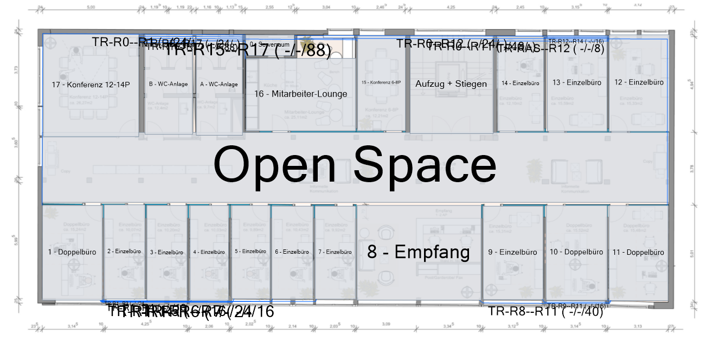](./img/office_floor_plan.png)

### Core Rack RA00 Layout (RA01-RA04)

* **Scope & Location:** Situated in the central server room (**R00**), this main rack houses the entire enterprise core infrastructure. It hosts the fully redundant High-Availability (HA) cluster (firewalls, core switches, WLAN controllers, and physical servers), the central power distribution (UPS/ATS), out-of-band management equipment, and the main environmental monitoring system. It manages room distributors **RA01, RA02, RA03, and RA04**

| RU&nbsp;Range | Front View | Back View |
| :---: | :---: | :---: |
| RU&nbsp;42-28 | 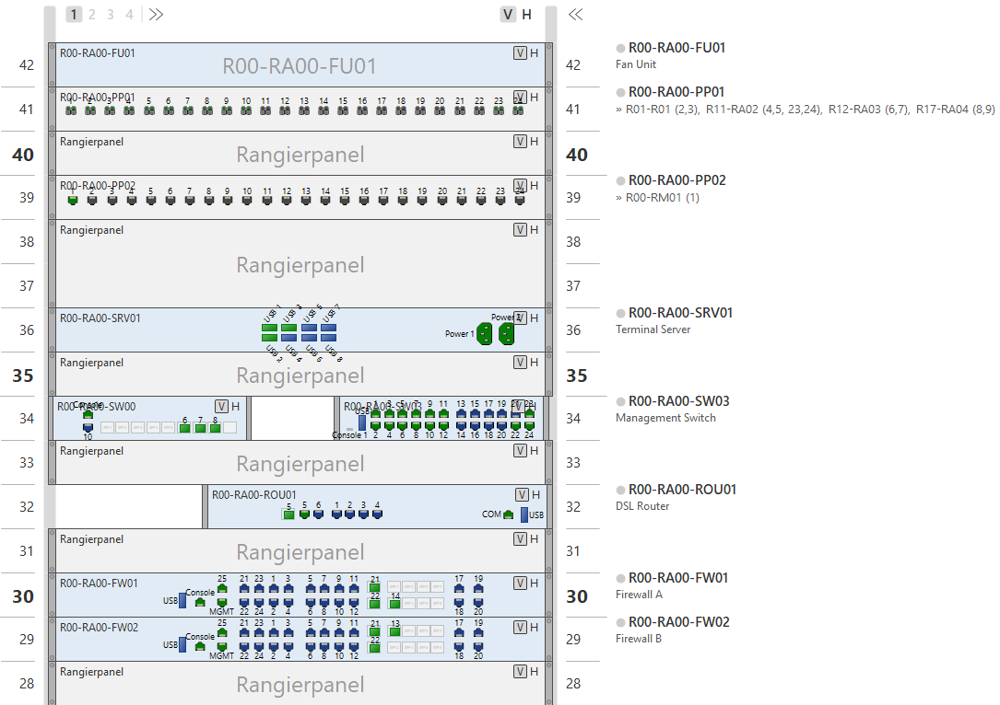 | 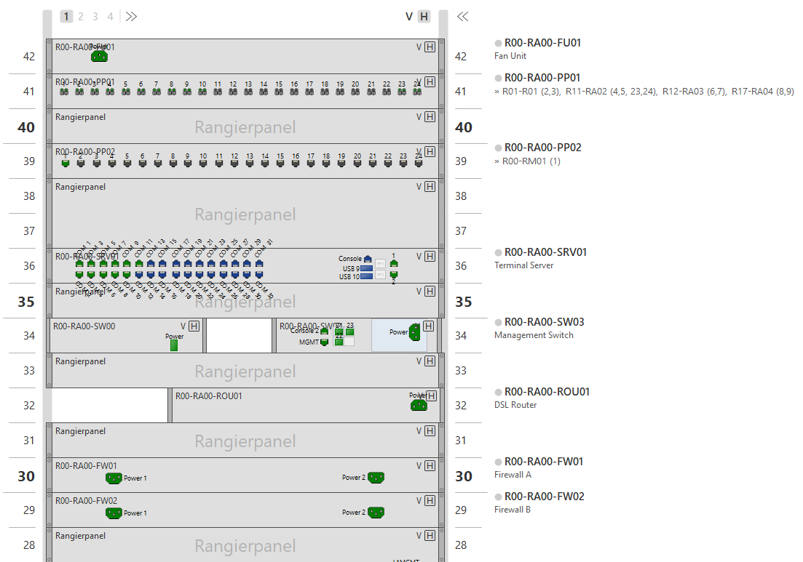 |
| RU&nbsp;27-18 | 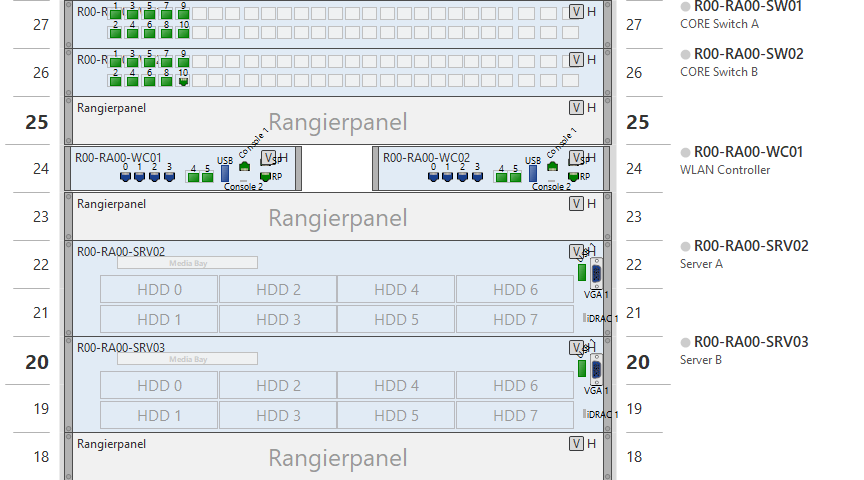 | 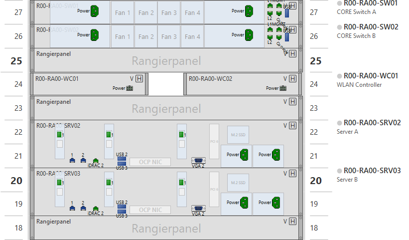 |
| RU&nbsp;16-1 | 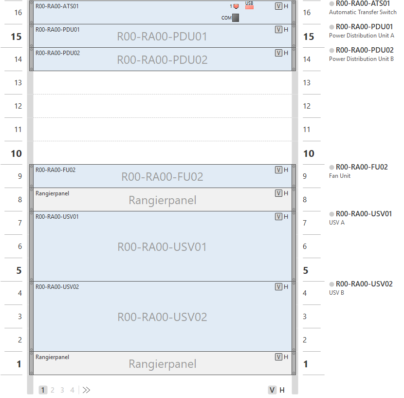 | 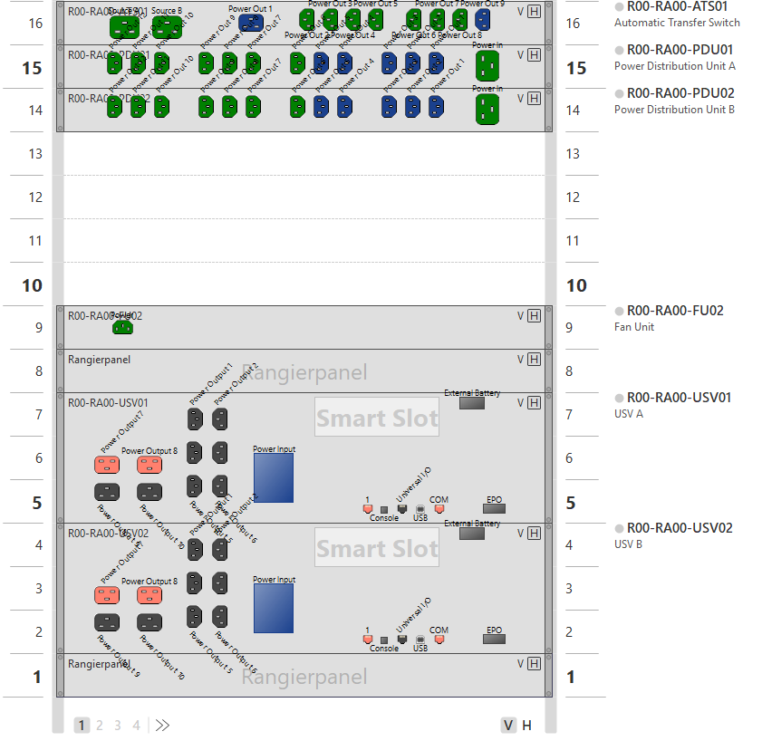 |

### Room Distribution Rack RA01 Layout (R01-R07)

* **Scope:** This distribution rack manages network connections for rooms **R01, R02, R03, R04, R05, R06, and R07**.

| Front View | Back View |
| :---: | :---: |
| 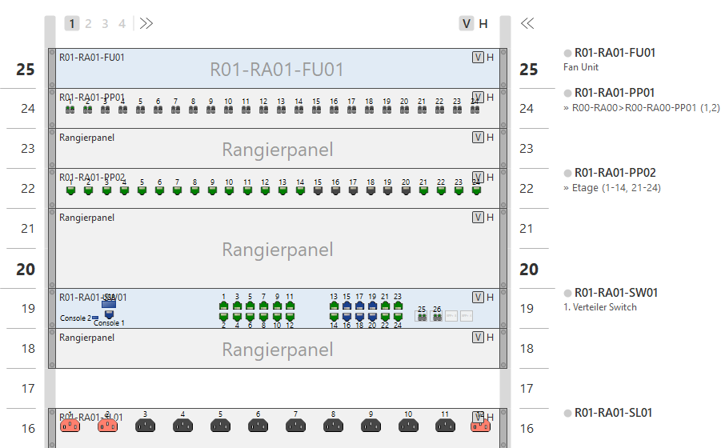 | 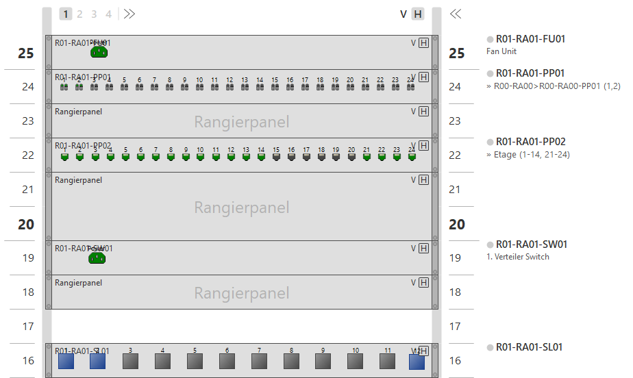 |

### Room Distribution Rack RA02 Layout (R08-R11)

* **Scope & Location:** Located in a separate fire compartment, this rack houses the decentralized NAS backup system. It manages network connections for rooms **R08, R09, R10, and R11**.

| Front View | Back View |
| :---: | :---: |
| 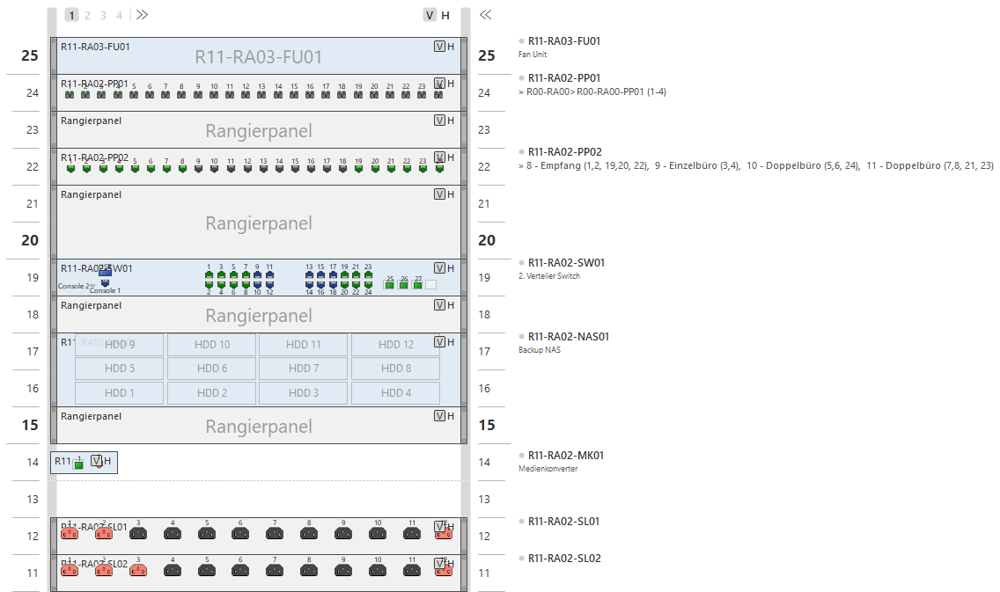 | 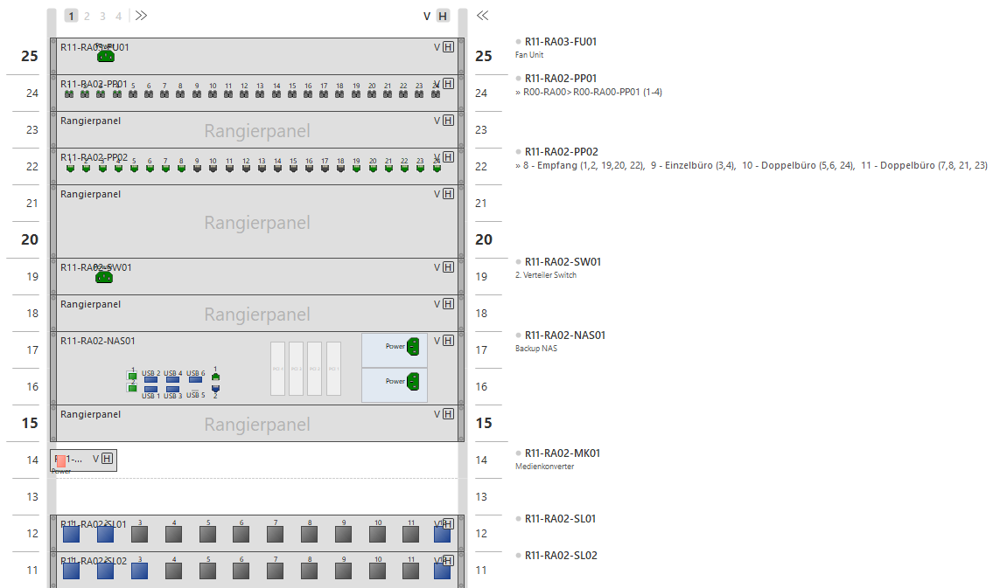 |

> **Note on Rack Showcase:**  
> The rack visualizations featured above serve as representative showcase examples of the infrastructure deployment. Additional floor distribution racks (e.g., managing rooms R12–R17) are fully integrated into the master network plan.

### Room 0 (R00) Infrastructure

* **Scope & Function:** Detailed spatial layout of the main server room (**R00**), highlighting the central rack deployment and critical environmental protection systems.
* **Key Components Identified in Layout:**
  * **Core Rack (`R00-RA00`):** Encloses the primary High-Availability (HA) network equipment, servers, and central power management.
  * **Environmental Monitoring System (`R00-RM01`):** APC NetBotz Room Monitor 355 managing connected room sensors for environmental control.
  * **Dedicated Room Sensors:** Temperature, Smoke and leak detection sensors placed around the server room to prevent physical water/fire damage.
  * **Access & Connectivity:** Integrated network outlet (`R00-DO1-LC`) and door/access control integration.

[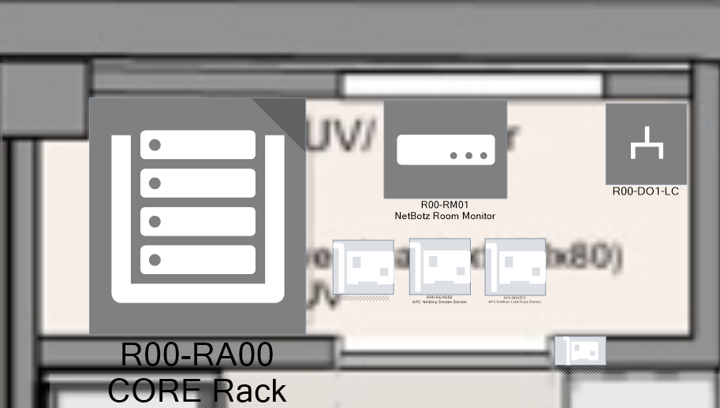](./img/r00_infrastructure.png)

### Room 1 (R01) Infrastructure

[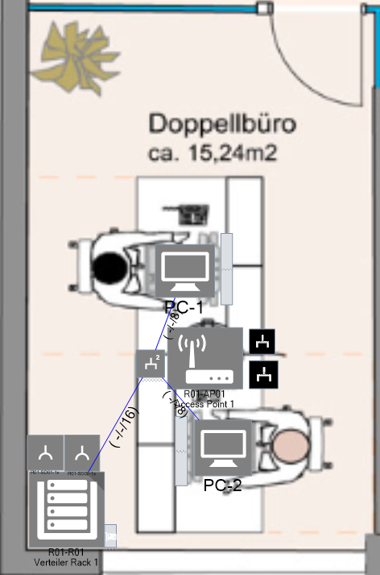](./img/r01_infrastructure.png)

### Room 17 (R17) Infrastructure

[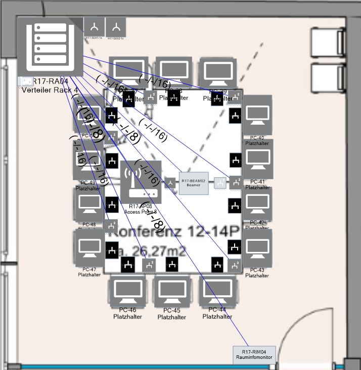](./img/r17_infrastructure.png)

## 💾 Pathfinder Projekt-Datei

Die vollständige Projekt- und Gebäudedokumentation inkl. aller Racks, Trassen und Kabelverbindungen liegt als **Pathfinder-Export** im Repository vor:

* **Datei:** [`/exports/campus-network-design.pfp`](./exports/campus-network-design.pfp)
* **Software:** Benötigt *Pathfinder (Kabel- und Asset-Management)* zum Importieren und Bearbeiten der vollständigen 3D-/Rack-Ansichten.

## About

Created by Manuel Amberger, a student at a technical high school (HTL) in austria.
